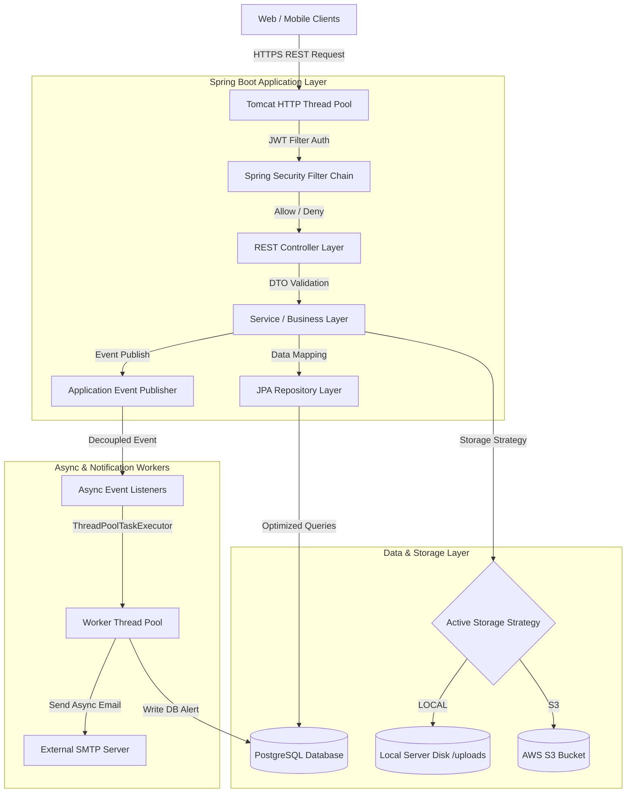
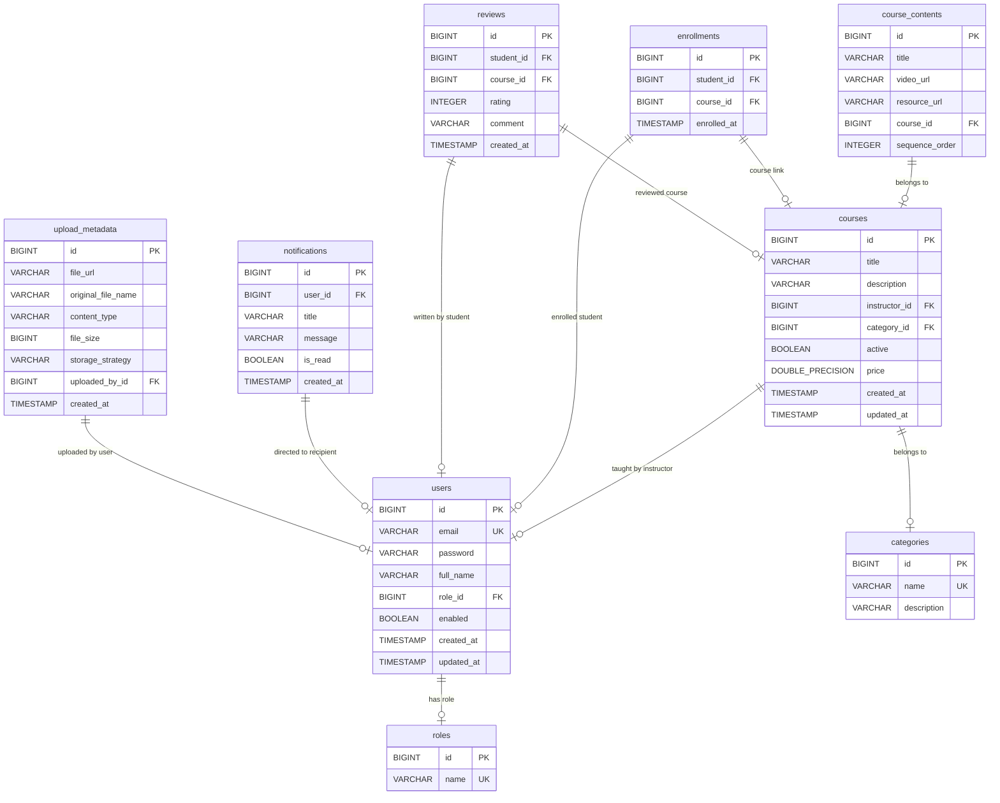
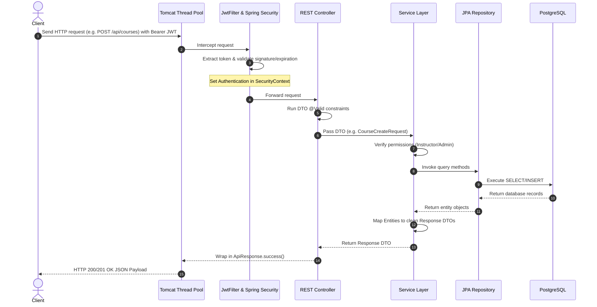
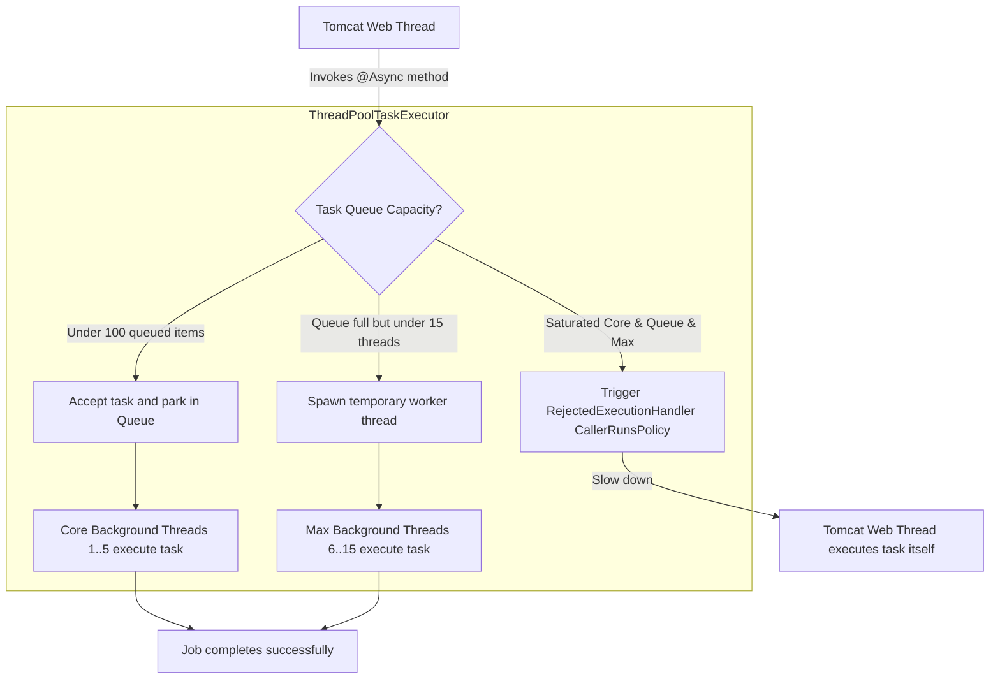
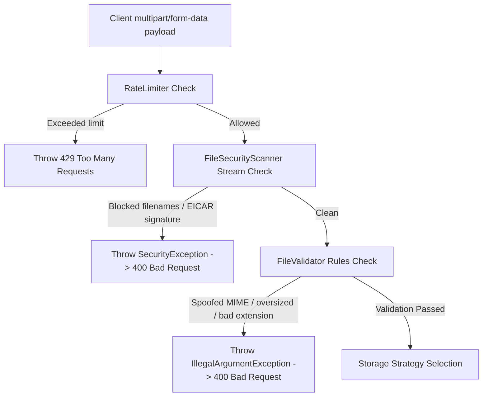
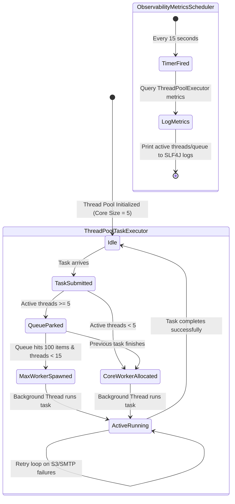
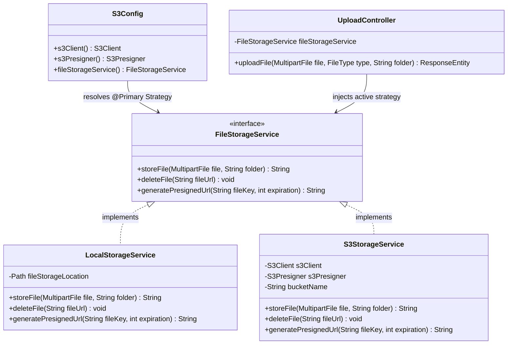

# Eduverse Backend System Architecture Documentation

Welcome to the **Eduverse Production-Grade Architecture Documentation**. This document contains a comprehensive breakdown of the architectural designs, database mappings, and process lifecycles of the Eduverse platform. It features **10 detailed Mermaid diagrams** mapping every corner of the system.

---

## 1. System Architecture Overview

Eduverse follows a clean, modular **layered monolithic architecture** built on top of the **Spring Boot** framework. The system is designed to be highly secure, resilient, and horizontally scalable. It balances ease of development with high-performance operational components such as multi-strategy cloud storage, thread-pool offloading, and decoupled event multicasting.

### Layered Structure
* **API Controller Layer**: Exposes secure REST endpoints, consumes/validates DTOs, and handles HTTP response wrapping.
* **Service/Business Logic Layer**: Enforces transactional constraints (`@Transactional`) and implements business rules.
* **Data Access (Repository) Layer**: Interfaces with PostgreSQL using Spring Data JPA, optimized with custom fetch joins to prevent the N+1 select problem.
* **Infrastructure/Security Layer**: Intercepts requests using Spring Security filters, validates JWT tokens, rates limits uploads, and hosts async task execution thread pools.

---

## 2. All 10 Production-Grade System Diagrams

### Diagram 1: Complete System Architecture (High-Level overview)
This diagram maps how clients traverse firewalls, auth layers, HTTP thread managers, and delegate slow operations to background workers.



---

### Diagram 2: Database ER Diagram (PostgreSQL Schema)
Maps all primary tables, fields, data types, indexes, and relational cardinalities.



---

### Diagram 3: Full Backend HTTP Request-Response Flow
Shows the lifecycle of a request entering the system, passing filters, executing services, and returning a DTO-only API Response.



---

### Diagram 4: Security Architecture Topology
Illustrates how endpoints are split between public access bypass pathways and role-protected JWT filters.

```mermaid
graph TD
    Request[Incoming API Request] --> RouteCheck{Matches Path Rules?}
    
    RouteCheck -->|"/api/auth/**"<br>"/uploads/**"<br>"/swagger-ui.html"| Public[Bypass JWT Authentication]
    RouteCheck -->|"/api/courses/**" GET<br>"/api/categories/**" GET| Public
    
    RouteCheck -->|"/api/courses" POST<br>"/api/notifications/**"<br>"/api/uploads"| Secured[JwtFilter Interception]
    
    Public --> ExecuteEndpoint[Execute Controller Endpoint]
    
    Secured --> TokenCheck{Valid JWT Header?}
    TokenCheck -->|No / Expired| AuthError[Throw 401 Unauthorized]
    TokenCheck -->|Yes| LoadSecurity[Load User Roles into Context]
    
    LoadSecurity --> RoleCheck{Has Required Role?}
    RoleCheck -->|No| AccessError[Throw 403 Forbidden]
    RoleCheck -->|Yes| ExecuteEndpoint
```

---

### Diagram 5: JWT Authentication Lifecycle
Maps the step-by-step token generation during registration/login and downstream verification on subsequent client requests.

```mermaid
graph TD
    subgraph Step 1: Token Issuance (Login)
        A[Client POST /api/auth/login] --> B[AuthenticationManager verifies BCrypt hash]
        B -->|Success| C[JwtService generates token claims]
        C -->|Payload| D[Inject sub: Username, role: RoleName, exp: 24h]
        D -->|Sign| E[Secure sign using HMAC-SHA256 & JWT Secret]
        E -->|Return| F[HTTP 200 with JWT Token DTO]
    end
    
    subgraph Step 2: Client Storage
        F -->|Client saves| G[Session/Local Storage]
    end
    
    subgraph Step 3: Token Verification (Authorized Request)
        G -->|Subsequent call| H[Inject Authorization: Bearer TOKEN header]
        H --> I[JwtFilter intercepts request]
        I --> J{Valid Signature & Expiration?}
        J -->|Invalid| K[Return 401 Unauthorized Response]
        J -->|Valid| L[Extract sub & roles]
        L --> M[Populate UsernamePasswordAuthenticationToken in SecurityContext]
        M --> N[Forward to downstream REST controller]
    end
```

---

### Diagram 6: Async Processing Architecture
Details how long-running blocking processes are decoupled using thread allocation.



---

### Diagram 7: Event-Driven Architecture (EDA) Lifecycle
Maps how business actions publish immutable events, allowing listeners to execute detached background dispatches.

```mermaid
graph TD
    subgraph Publisher Context
        A[Student purchases course] --> B[EnrollmentService registers enrollment in DB]
        B --> C[Publish EnrollmentCreatedEvent to ApplicationEventPublisher]
        C --> D[Return instant HTTP 200 EnrollmentResponse DTO to student]
    end
    
    subgraph Event Multicaster Engine
        C --> E[Spring Event Multicaster]
    end
    
    subgraph Background Listener Context
        E -->|Multicast| F[EmailEventListener]
        E -->|Multicast| G[NotificationEventListener]
        
        F -->|@Async taskExecutor| H[Render HTML Template & Trigger AsyncEmailService]
        G -->|@Async taskExecutor| I[Persist DB-backed alert Notification entity]
    end
    
    subgraph External Infrastructure
        H -->|SMTP| J[Student Welcome Inbox]
        H -->|SMTP Fallback| K[Dump rich HTML body to System SLF4J Logs]
        I -->|JPA Save| L[(PostgreSQL Notifications Table)]
    end
```

---

### Diagram 8: File Upload Security Pipeline
Details the multi-stage defense gates that incoming multipart streams pass through before storage execution is allowed.



---

### Diagram 9: Thread Pool & Async Execution Lifecycle
Visualizes thread lifespans, task queues, and pool monitoring scheduler configurations.



---

### Diagram 10: Cloud Storage Strategy Design Pattern
Maps the abstract strategy pattern allowing pluggable local storage directory fallback alongside AWS S3 buckets.


