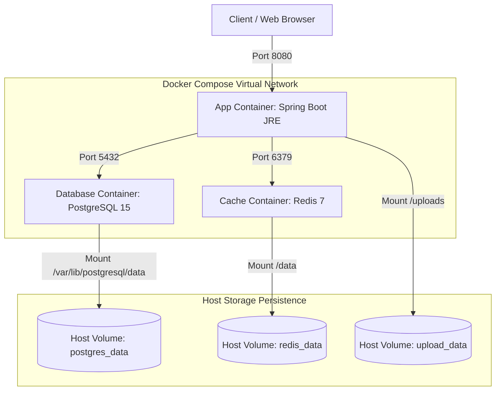
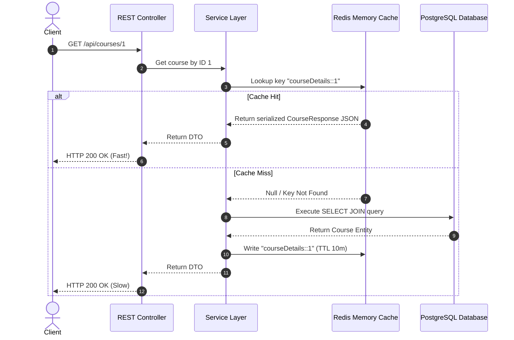
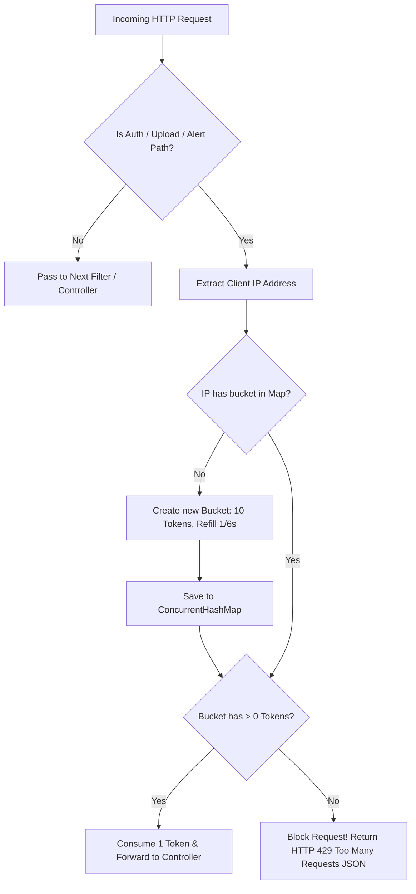
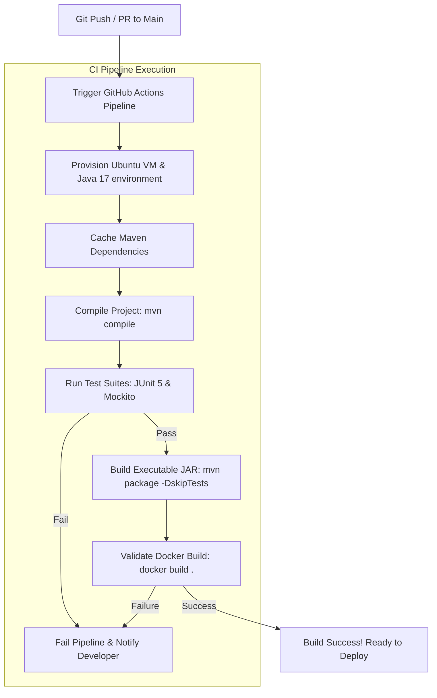
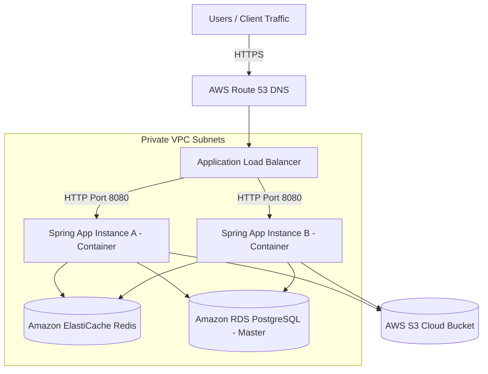
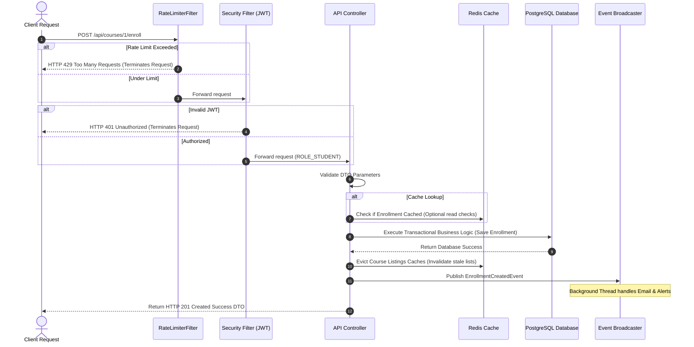

# Implementation Plan: Phase 4 - Dockerization, Caching, Rate Limiting, Observability, and CI/CD Pipelines

This implementation plan details the architectural designs, advanced conceptual Q&As, and file modification details to transform the **Eduverse** system into a production-ready, highly resilient, and containerized backend engine.

---

## 1. Core Architectural & Systems Design Concepts

Before writing any configuration or code, let's establish the technical foundations for each production-grade component:

### A. Dockerization & Container Orchestration

#### Why it exists:
In traditional deployments, developers face the "works on my machine" problem due to differing operating systems, installed library versions, and system configurations. **Docker** solves this by packaging the application and all its dependencies (PostgreSQL database, Redis cache, Java Runtime) into isolated, lightweight execution units called **containers**.

#### Production Relevance & Scalability:
* **Portability**: Containers run identically on any platform that supports Docker (local Mac/Windows, AWS EC2, Kubernetes).
* **Isolation**: Containers do not share dependencies. Upgrading Java inside the application container does not affect the host OS or other services.
* **Microservices Ready**: Scaling the backend simply means booting up more instances of the Docker image behind a load balancer.

```
       ┌────────────────────────────────────────────────────────┐
       │                 DOCKER VIRTUAL NETWORK                 │
       ├────────────────────────────────────────────────────────┤
       │   ┌────────────────┐   ┌──────────────┐   ┌────────┐   │
       │   │  App Container │   │ PostgreSQL   │   │ Redis  │   │
       │   │ (Spring Boot)  │◄─►│ (Database)   │◄─►│(Cache) │   │
       │   │  Port 8080     │   │ Port 5432    │   │Port6379│   │
       │   └───────▲────────┘   └──────────────┘   └────────┘   │
       └───────────┼────────────────────────────────────────────┘
                   │ Port 8080 Mapping
                   ▼
         [ External Users / HTTP Traffic ]
```

---

### B. Redis Caching & Spring Cache Integration

#### Why it exists:
Reading from a database is a relatively slow operation because it requires disk I/O, parsing SQL queries, and executing relational joins. **Caching** stores frequently accessed, read-heavy data in memory (RAM), allowing responses to be fetched in microseconds instead of milliseconds.

#### The Cache Life Cycle:
1. **Cache Miss**: A client requests course details. The application looks inside the Redis cache. The data is *not* present (Cache Miss). The app executes the slow PostgreSQL query, retrieves the record, writes it into Redis, and returns it to the client.
2. **Cache Hit**: A second client requests the same course. The app checks Redis, finds the record (Cache Hit), and immediately returns it in microseconds, completely bypassing the database.
3. **Time to Live (TTL)**: To prevent stale data, each cache entry has an expiration time (e.g., 10 minutes). Once expired, the next read triggers a fresh database fetch.
4. **Cache Invalidation (Eviction)**: If an instructor updates a course, the cached details become obsolete. We must immediately **evict** (delete) the stale entries from Redis using `@CacheEvict` so clients always receive accurate data.

```
                      Client GET Request
                             │
                             ▼
                     [ Check Redis Cache ]
                             │
              ┌──────────────┴──────────────┐
     Cache Hit│                       Cache │ Miss
              ▼                             ▼
       Return Cache JSON             Query PostgreSQL DB
       (Microseconds!)                      │
                                            ▼
                                     Write into Redis
                                            │
                                            ▼
                                      Return Response
```

---

### C. Rate Limiting via Bucket4j

#### Why it exists:
Secured endpoints (like `/api/auth/login`) are prime targets for brute-force password cracking attacks. Other endpoints (like `/api/uploads`) can be abused by spam uploads, filling up disk storage. **Rate Limiting** restricts the number of requests a user or IP address can make within a given time frame.

#### The Token Bucket Algorithm:
Imagine a bucket that holds a maximum of $N$ tokens. Every incoming HTTP request consumes exactly 1 token. If the bucket has tokens, the request is allowed. If the bucket is empty, the request is rejected with an HTTP **`429 Too Many Requests`** status. The bucket refills at a constant, configurable rate (e.g., 1 token every 6 seconds).

```
                      Incoming Request
                             │
                             ▼
                 [ Check Bucket for IP ]
                             │
              ┌──────────────┴──────────────┐
    Token Available?                No Tokens Available
              │                             │
              ├─► YES                       └─► NO
              │                                 │
              ▼ (Consume 1 Token)               ▼
       Execute Endpoint               Return HTTP 429 Error
```

---

### D. Observability via Spring Boot Actuator

#### Why it exists:
Once an application is deployed to production, we cannot inspect its state easily. We need to know: *Is the database connection alive? How much memory is JVM consuming? Are our background threads saturated?* **Spring Boot Actuator** exposes secure HTTP endpoints that provide active monitoring telemetry.

#### Actuator Endpoints:
* **`/actuator/health`**: Simple status (`UP`/`DOWN`). Orchestration tools (like Kubernetes or AWS) poll this to verify if the container is healthy.
* **`/actuator/metrics`**: Exposes real-time JVM CPU, memory usage, HTTP request tallies, and active thread-pool counts.
* **`/actuator/info`**: Exposes general metadata (application version, git commit hashes).
* **`/actuator/env`**: Lists configured application properties (sensitive values are masked automatically).

---

## 2. All 6 Phase 4 Production-Grade Diagrams

### Diagram 1: Complete Container Architecture & Docker Compose Topology
Shows how Docker Compose isolates services, configures virtual networks, and binds database and cache data persistently to host volumes.



---

### Diagram 2: Redis Cache-Aside Pattern Request Lifecycle
Details how the system coordinates cache lookups, database fallbacks, and transactional evictions on mutations.



---

### Diagram 3: Token Bucket Rate Limiting Filter Chain
Illustrates how the Bucket4j custom filter intercepts spam requests and protects database auth pipelines.



---

### Diagram 4: GitHub Actions CI/CD Pipeline Workflow
Illustrates the automated pipeline executing tests, packaging JAR binaries, and validating Docker building structures.



---

### Diagram 5: Production Deployment & Scale Architecture
Visualizes how containerized instances scale horizontally behind an Application Load Balancer (ALB) in a secure Cloud environment.



---

### Diagram 6: Comprehensive Request Lifecycle with Caching & Rate Limiting Combined
A full, top-to-bottom pipeline showing the exact security, rate-limiting, authentication, caching, database, and background worker interactions.



---

## 3. Proposed Changes

We will modify the project files located at `/Users/yogeshberwal/Desktop/eduverse/`.

```
eduverse/
├── pom.xml                                  [MODIFY] Add Redis, Actuator, Bucket4j dependencies
├── src/main/resources/
│   ├── application.properties               [MODIFY] Core profile, actuator setups
│   ├── application-dev.properties           [NEW] Local DB & Redis setups
│   └── application-prod.properties          [NEW] Prod metrics, Hikari tuning, S3, secure Redis
├── src/main/java/com/eduverse/
│   ├── config/
│   │   ├── CacheConfig.java                 [NEW] Spring cache & Jackson serializer
│   │   └── SecurityConfig.java              [MODIFY] Permit /actuator/** and rate limiter pathing
│   ├── security/
│   │   └── RateLimitingFilter.java          [NEW] Custom Bucket4j request interceptor
│   └── service/
│       ├── CourseService.java               [MODIFY] Inject caching @Cacheable/@CacheEvict hooks
│       └── CategoryService.java             [MODIFY] Inject caching @Cacheable/@CacheEvict hooks
├── Dockerfile                               [NEW] Multi-stage build image
├── docker-compose.yml                       [NEW] Full multi-service dev orchestration
└── .github/workflows/
    └── backend-ci.yml                       [NEW] Automated GitHub Actions pipeline
```

### File-by-File Breakdown:

#### 1. [MODIFY] [pom.xml](file:///Users/yogeshberwal/Desktop/eduverse/pom.xml)
* Add dependencies:
  - `org.springframework.boot:spring-boot-starter-data-redis` (for caching support)
  - `org.springframework.boot:spring-boot-starter-actuator` (for production health monitoring)
  - `io.github.bucket4j:bucket4j-core` (lightweight rate limiter core)

#### 2. [MODIFY] [application.properties](file:///Users/yogeshberwal/Desktop/eduverse/src/main/resources/application.properties)
* Set `spring.profiles.active=dev` by default.
* Configure general actuator settings:
  ```properties
  management.endpoints.web.exposure.include=health,metrics,info,env
  management.endpoint.health.show-details=always
  ```

#### 3. [NEW] [application-dev.properties](file:///Users/yogeshberwal/Desktop/eduverse/src/main/resources/application-dev.properties)
* Dev-specific profiles:
  - `spring.datasource.url=jdbc:postgresql://localhost:5432/eduverse` (or `db:5432` inside docker networks)
  - `spring.data.redis.host=localhost` (or `redis` inside docker networks)
  - Local S3 storage fallback toggled.

#### 4. [NEW] [application-prod.properties](file:///Users/yogeshberwal/Desktop/eduverse/src/main/resources/application-prod.properties)
* Production metrics configurations:
  - Connection pool tuning via Hikari (`maximum-pool-size=20`, `minimum-idle=5`).
  - Read S3 and DB configurations strictly from environment variables.
  - Require secure TLS for Redis caches.

#### 5. [NEW] [CacheConfig.java](file:///Users/yogeshberwal/Desktop/eduverse/src/main/java/com/eduverse/config/CacheConfig.java)
* Enable caching utilizing `@EnableCaching`.
* Create `RedisCacheConfiguration` declaring `RedisCacheManager`.
* Configure key-value serializers using Jackson JSON serializer so cached objects can be inspected directly in Redis without binary gibberish.

#### 6. [NEW] [RateLimitingFilter.java](file:///Users/yogeshberwal/Desktop/eduverse/src/main/java/com/eduverse/security/RateLimitingFilter.java)
* Implement a custom rate limiter filter subclassing `OncePerRequestFilter`.
* Intercept `/api/auth/login`, `/api/auth/register`, and `/api/uploads/**`.
* Track client IPs, maintain dynamic token buckets (10 tokens max, refills 1 token every 6 seconds).
* Return HTTP 429 with standard `ApiResponse` JSON envelopes on blocks.

#### 7. [MODIFY] [SecurityConfig.java](file:///Users/yogeshberwal/Desktop/eduverse/src/main/java/com/eduverse/config/SecurityConfig.java)
* Allow unrestricted access to `/actuator/**` so external monitoring engines can fetch health metrics.
* Register `RateLimitingFilter` inside the security filter chain before the main JWT filters.

#### 8. [MODIFY] [CourseService.java](file:///Users/yogeshberwal/Desktop/eduverse/src/main/java/com/eduverse/service/CourseService.java)
* Add `@Cacheable` to `getCourses` (active list checks) and `getCourseById`.
* Add `@CacheEvict` to course mutation endpoints (`createCourse`, `updateCourse`, `deleteCourse`) to invalidate stale caches.

#### 9. [MODIFY] [CategoryService.java](file:///Users/yogeshberwal/Desktop/eduverse/src/main/java/com/eduverse/service/CategoryService.java)
* Cache categories lists. Evict on new category creations.

#### 10. [NEW] [Dockerfile](file:///Users/yogeshberwal/Desktop/eduverse/Dockerfile)
* Multi-stage build process:
  - Stage 1: Build JAR from source using `maven:3.8.5-openjdk-17-slim`.
  - Stage 2: Create a minimal deployment JRE container using `eclipse-temurin:17-jre-alpine` (lightweight and secure).

#### 11. [NEW] [docker-compose.yml](file:///Users/yogeshberwal/Desktop/eduverse/docker-compose.yml)
* Setup multi-container development environment containing `app`, `db` (PostgreSQL), and `redis` services.

#### 12. [NEW] [backend-ci.yml](file:///Users/yogeshberwal/Desktop/eduverse/.github/workflows/backend-ci.yml)
* Automatic compilation, JUnit testing, JAR packaging, and docker validation pipeline.

---

## 4. Verification & Testing Plan

### 1. Docker Validation
* **Command**: `docker-compose up --build -d`
* **Verification**: Verify all three containers (`eduverse-backend`, `eduverse-db`, `eduverse-redis`) show status `Up` via `docker-compose ps`.

### 2. Redis Caching Validation
* **Test**: Execute `GET /api/courses` twice.
* **Verification**:
  - The first request triggers Hibernate SQL logs in the terminal.
  - The second request returns the JSON immediately **without** triggering SQL logs (Cache Hit!).
* **Eviction Test**: Create or update a course. The next read to `/api/courses` should trigger a fresh SQL query log, confirming cache invalidation.

### 3. API Rate Limiting Validation
* **Test**: Send 11 rapid login attempts to `/api/auth/login` within 5 seconds.
* **Verification**: The 11th request must immediately return HTTP `429 Too Many Requests` with a structured JSON error body:
  ```json
  {
    "success": false,
    "message": "Too many requests. Please try again later.",
    "data": null
  }
  ```

### 4. Actuator Health Checks
* **Endpoint**: `GET http://localhost:8080/actuator/health`
* **Verification**: Response JSON must show:
  ```json
  {
    "status": "UP",
    "components": {
      "db": { "status": "UP" },
      "redis": { "status": "UP" }
    }
  }
  ```

---

## 5. Escalation & Execution Order
We will implement these changes sequentially:
1. **Dependencies & Core Config**: Update `pom.xml` and properties profiles.
2. **Observability Integration**: Add Actuator and modify security access limits.
3. **API Protection Setup**: Implement `RateLimitingFilter` and register it.
4. **Data Cache Engine**: Implement `CacheConfig` and apply `@Cacheable`/`@CacheEvict` in services.
5. **Orchestration & Packaging**: Generate `Dockerfile` and `docker-compose.yml`.
6. **Automation Workflow**: Create `.github/workflows/backend-ci.yml`.
7. **Complete Verification & Comprehensive Walkthrough docs generation**.
